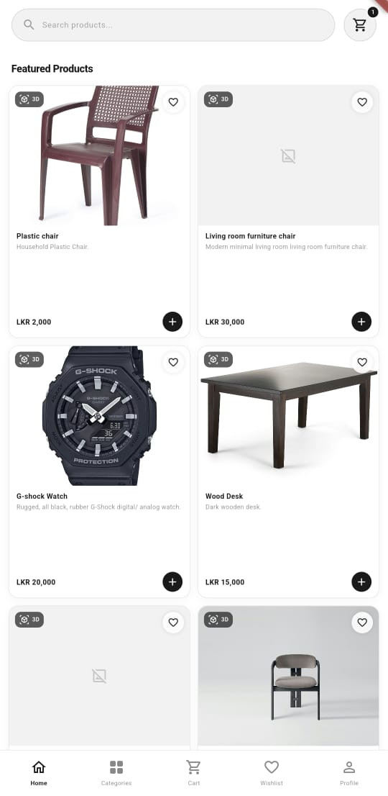
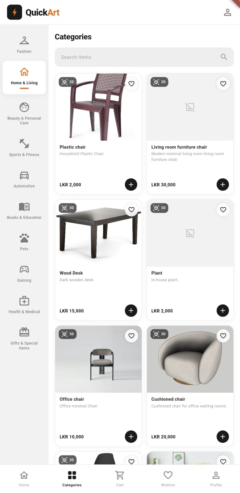
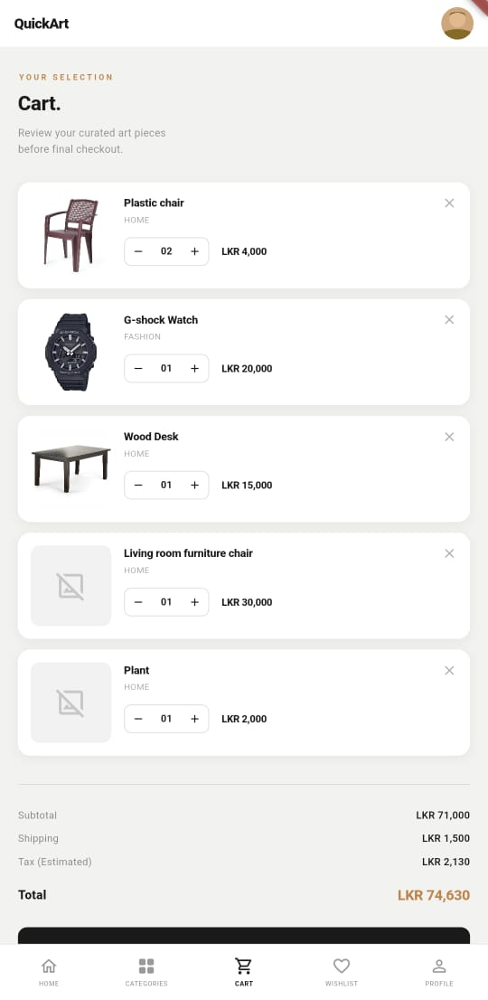
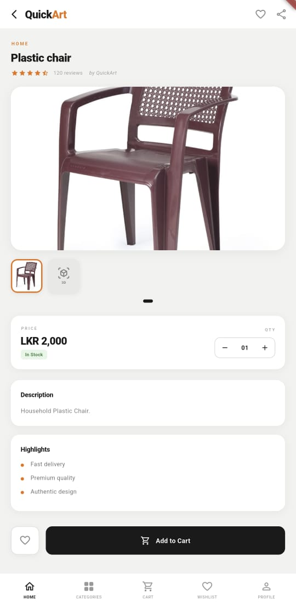

# 🛒 Quickart Mobile App

A modern, responsive e-commerce mobile application built with Flutter, designed to provide a seamless and consistent shopping experience aligned with the Quickart web platform.

---

## 📌 About
Quickart is a feature-rich mobile application developed to replicate and extend the functionality of the Quickart web-based e-commerce system. The app follows the same design structure, ensuring a unified user experience across platforms.

It enables users to explore products, view detailed descriptions, and interact with a scalable cloud-based backend. The system leverages modern technologies to ensure performance, reliability, and efficient data handling.

🔗 **Quickart Web Repository:**  
https://github.com/kdsmaduranga/Quickart
---

## ✨ Features
- Clean and responsive mobile UI based on Quickart web design  
- Product browsing with detailed descriptions  
- Advanced search and filtering functionality  
- User account creation and management  
- Cloud-based database integration using MongoDB Atlas  
- Image storage and fast delivery using AWS S3  
- Smooth performance powered by Flutter framework  

---

## 🛠️ Tech Stack

### Frontend
- Flutter (Dart)

### Backend & Cloud Services
- MongoDB Atlas – Stores user data and product details  
- AWS S3 – Handles image storage and retrieval  

---

## 🚀 Getting Started

### 1. Clone the repository
```bash
git clone https://github.com/lynx7843/Quickart-mobile
```

### 2. Navigate to the project directory
```bash
cd quickart_mobile
```

### 3. Install dependencies
```bash
flutter pub get
```

### 4. Run the application
```bash
flutter run
```

---

## 📸 Preview (Screenshots)

> Below are some screenshots of the Quickart mobile application interface.

###  Home Screen


### Categories


###  Cart


###  Item Card



